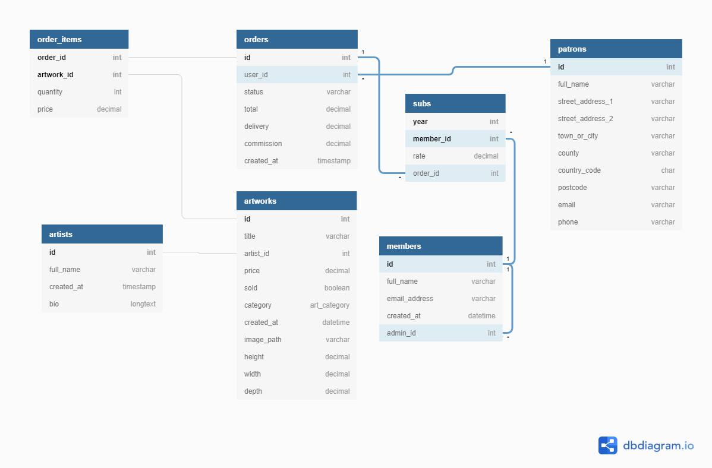

- [MSP4 art sales](#msp4-art-sales)
  * [UX](#ux)
    + [User Stories](#user-stories)
    + [Strategy plane](#strategy-plane)
    + [Scope plane](#scope-plane)
    + [Structure plane](#structure-plane)
    + [Skeleton plane](#skeleton-plane)
      - [Database](#database)
    + [Surface plane](#surface-plane)
      - [Colour palette](#colour-palette)
      - [Typeface](#typeface)
  * [Features](#features)
    + [Existing Features](#existing-features)
    + [Features Left to Implement](#features-left-to-implement)
  * [Technologies Used](#technologies-used)
  * [Testing](#testing)
  * [Deployment](#deployment)
  * [Credits](#credits)
    + [Content](#content)
    + [Media](#media)
    + [Acknowledgements](#acknowledgements)

[TOC](http://ecotrust-canada.github.io/markdown-toc/)

# MSP4 art sales

This is Prickwillow Art Club's sales site.

By providing its members with a portal to sell their work, the club sustains itself with any sales commission that is generated.
This 'profit' can be ploughed back into the art club's activities.

It will be useful to record the patronage of the art club and gain some understanding of the market for their members work.

--- 
## UX
 
Use this section to provide insight into your UX process, focusing on who this website is for, what it is that they want to achieve and how your project is the best way to help them achieve these things.

### User Stories

- As a visitor to the site I would like to view art works for sale.

- As a patron I would like to buy artworks within my price range and likes.
- As a frequent patron I would like to keep a record of my purchases with the club.
- As a patron I would like to keep a running total of incomplete orders.

- As a club member I would like to purchase my year's club membership subscription remotely.

- As a club administrator I would like to enter new works of art as images with details such as price, media and dimensions of the piece.
- As a club administrator I would like to distribute funds from sales commission to activities that will benefit the club.

This section is also where you would share links to any wireframes, mockups, diagrams etc. that you created as part of the design process. These files should themselves either be included as a pdf file in the project itself (in an separate directory), or just hosted elsewhere online and can be in any format that is viewable inside the browser.

### Strategy plane

### Scope plane

### Structure plane

### Skeleton plane

#### Wireframes
Mobile-first responsiveness screen design.
Different screen sizes:

Chrome's Inspect emulator |	width	| breakpoint
--------------------------|---------|-------------
Nokia Lumia	|320px	|(default)
Nexus 7	    |600px	|s
iPad :	    |768px	|m
Kindle Fire:	        |800px|	m
iPad Pro:	            |1024px|	l
Laptop with MDPI screen	|1280px|	xl

#### Database

Using [DBdiagram](https://dbdiagram.io/home) to display the database schema for the club's sales.

### Surface plane

#### Colour palette

Using [Coolors](https://coolors.co/) to select web site's colour scheme.

A neutral, pastel blue has been selected as a uniform background colour for the page header and footer. (#D9E6F3).
Any variations to this colour comes from the limited pallet:

#### Typeface

The typeface has been chosen, font family 'Roboto' with backup font family of 'Arial'.

---
## Features

In this section, you should go over the different parts of your project, and describe each in a sentence or so.
 
### Existing Features
- Feature 1 - allows users X to achieve Y, by having them fill out Z
- ...

For some/all of your features, you may choose to reference the specific project files that implement them, although this is entirely optional.

In addition, you may also use this section to discuss plans for additional features to be implemented in the future:

### Features Left to Implement
- Another feature idea

---
## Technologies Used

In this section, you should mention all of the languages, frameworks, libraries, and any other tools that you have used to construct this project. For each, provide its name, a link to its official site and a short sentence of why it was used.

- [Bootstrap](https://getbootstrap.com/) to provide a mobile-first responsive framework for the site.
- [Font Awesome](https://fontawesome.com/) to provide additional icons.
- [JavaScript](https://www.javascript.com/) to provide core API and DOM manipulation.
- [JQuery](https://jquery.com) to simplify DOM manipulation.
- [Python 3](https://www.python.org/about/)    
    - Programming language used to interact with a database and framework.
    - [Docstring PEP 257](https://www.python.org/dev/peps/pep-0257/) documentation convention followed.
- [Django Framework](https://www.djangoproject.com/start/overview/)
    - [Authentication system](https://django-allauth.readthedocs.io/en/latest/installation.html) 
- [Stripe Payments](https://stripe.com/gb)
- [TOC for markdown](https://ecotrust-canada.github.io/markdown-toc/) to generate table of contents for README
- [Coolors](https://coolors.co/) for site's limited colour palette choices.
- [Responsiveness](http://ami.responsivedesign.is/) to check site's ability to scale up and down.
- [Django Secret Key Generator](https://miniwebtool.com/django-secret-key-generator/)
---
## Testing

In this section, you need to convince the assessor that you have conducted enough testing to legitimately believe that the site works well. Essentially, in this part you will want to go over all of your user stories from the UX section and ensure that they all work as intended, with the project providing an easy and straightforward way for the users to achieve their goals.

Whenever it is feasible, prefer to automate your tests, and if you've done so, provide a brief explanation of your approach, link to the test file(s) and explain how to run them.

For any scenarios that have not been automated, test the user stories manually and provide as much detail as is relevant. A particularly useful form for describing your testing process is via scenarios, such as:

1. Contact form:
    1. Go to the "Contact Us" page
    2. Try to submit the empty form and verify that an error message about the required fields appears
    3. Try to submit the form with an invalid email address and verify that a relevant error message appears
    4. Try to submit the form with all inputs valid and verify that a success message appears.

In addition, you should mention in this section how your project looks and works on different browsers and screen sizes.

You should also mention in this section any interesting bugs or problems you discovered during your testing, even if you haven't addressed them yet.

If this section grows too long, you may want to split it off into a separate file and link to it from here.

---
## Deployment

### Initial Heroku App Creation

Heroku app name is msp4-art-sales.

It is connected to a django postgres database service.

This section should describe the process you went through to deploy the project to a hosting platform (e.g. GitHub Pages or Heroku).

In particular, you should provide all details of the differences between the deployed version and the development version, if any, including:
- Different values for environment variables (Heroku Config Vars)?
- Different configuration files?
- Separate git branch?

In addition, if it is not obvious, you should also describe how to run your code locally.

---
## Credits

### Content
- The text, for better or worse, is the author's work of imagination.

### Media
- The photos used in this site were taken from the author's works.

### Acknowledgements

- I received inspiration for this project from [Ely Art Society](https://www.elyartsociety.com/)
-  also [Artsy](https://www.artsy.net/)

- Many of the code segments were from [Code Institute](https://codeinstitute.net/)'s tutorials.
