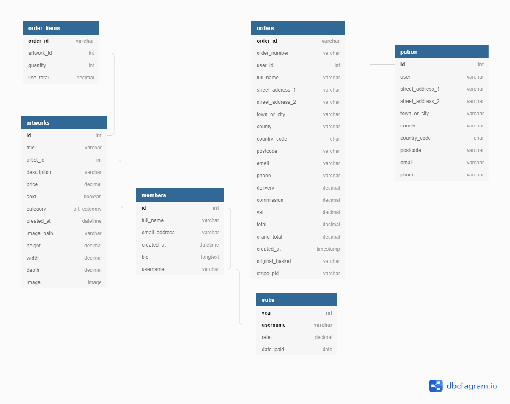

- [MSP4 art sales](#msp4-art-sales)
  * [UX](#ux)
    + [User Stories](#user-stories)
    + [Strategy plane](#strategy-plane)
    + [Scope plane](#scope-plane)
    + [Structure plane](#structure-plane)
    + [Skeleton plane](#skeleton-plane)
      - [Wireframes](#wireframes)
      - [Database](#database)
    + [Surface plane](#surface-plane)
      - [Colour palette](#colour-palette)
      - [Typeface](#typeface)
  * [Features](#features)
    + [Existing Features](#existing-features)
    + [Features Left to Implement](#features-left-to-implement)
  * [Technologies Used](#technologies-used)
  * [Testing](#testing)
  * [Deployment](#deployment)
  * [Credits](#credits)
    + [Content](#content)
    + [Media](#media)
    + [Acknowledgements](#acknowledgements)


# MSP4 art sales

[Code Institute's](https://codeinstitute.net/) fourth milestone project.

This is Prickwillow Art Club's sales site.

By providing its members with a portal to sell their work, the club sustains itself with any sales commission that is generated.
This 'profit' can be ploughed back into the art club's activities.

It will be useful to record the patronage of the art club and gain some understanding of the market for their members work.

--- 
## UX : User Experience
 
### User Stories

- As a visitor to the site I would like to view art works for sale.
  If I see something I like, I would like to know the price, what it's made of and size of it ( will it 'fit' on my wall or shelf ), as well as it's title and who made it.

- As a patron I would like to buy artworks within my price range and likes.
- As a frequent patron I would like to keep a record of my purchases with the club.
- As a patron I would like to keep a running total of incomplete orders,
            including V.A.T.,
            delivery charges (if not collecting)
            and potential commission to the club.

- As a club member I would like to purchase my year's club membership subscription remotely.
- As a member of the art club, I may like to have a record of my work that sold via the club's site.

- As a club administrator I would like to enter new works of art as images with details such as price, media and dimensions of the piece.
- As a club administrator I would like an idea of sales commissions in order to distribute funds to activities that will benefit the club.

### Strategy plane

The target audience for the proposed website is initially the local artistic community and those interested in art.
A wider artistic community would obviously be welcome for the club's members to sell their work.
A successful sale through the site would earn a small commission for the club.

### Scope plane

#### Requirements
There are 13 project requirements that feed the considerations of scope.

- Build a **Django** project.
- More than one app to be developed.
- Designing a relational database schema for **Postgres** to suit the needs of the user.
- User Authentication, by use of **allauth** to allow viewers to keep their orders over several sessions.
- User Interaction, at least one form with validation to be developed.
- At least one Django app should contain some e-commerce functionality using **Stripe**.
- A main navigation menu and structured layout is called for.
- The forntend user experience is to be enhanced with the use of **Javascript**.
- This README file to explain what the project does.
- Version Control by using Git and **GitHub**.
- Attribution - clearly state code that is not mine.
- Deploy the final version of project code to a hosting platform - **Heroku**.
- Security: no API key values, Secret Key values, passwords or Django DEBUG to be shown.

#### Constraints
There are constraints to be considered.
In order to charge club subscriptions, a Value Added Tax (VAT) component has to be incorporated.
See [UK Govt VAT](https://www.gov.uk/guidance/clubs-and-associations-vat-responsibilities-notice-7015#subscriptions)
The sale of art works is, at the time of writing, VAT rated at 20% in the [United Kingdom](https://www.gov.uk/tax-on-shopping) 

>When someone charges you VAT they multiply their selling price by the VAT rate to calculate the amount of VAT to charge.
They then add this to the selling price to give you the price you actually pay - this is called the ‘gross’ price.
-[UK Govt](https://www.gov.uk/tax-on-shopping/where-you-see-vat)

### Structure plane

#### Interaction Design (IXD)
 - consistent : convention of a navbar near the top of the page. Interactive buttons should have the same colour.
 - predictable : each page has the navbar with the same order of pathways.
 - learnable: the pathways through the site will be predictable.
 - visible: anything that requires a scroll is discoverable, there are content hints (e.g. 'image 5 of 7')
 - provides clear and intuitive feedback: 
    if you have added an artwork to the basket, you will not need to be prompted to shop, you already are.
    If there has been an error (a '404') then a page informing the user of the fact and a route away from the error is to be provided.

#### Information Architecture (IA)

More than 3 clicks to get to a conclusion can lead to 'cognitive overload', a casual visitor will not return.
For the visual arts, the image is king. This will be the first object(s) the visitor will be prompted to see.
The visitor will then be able to select further details of the artwork [2nd click], 'impulse buy' [still 2nd click] or then on viewing details, have the choice to buy or view other works [3rd click].

If the visitor is interested in buying the work, then they should be presented with the choice of entering and saving their details for further purchases ('a patron').
They will have to enter information for their credit card payment [**STRIPE**], so why not?

A club member would log in to the application to be able to pay their subscription. This should be as easy as a 'patron' buying a work.

As a 'patron' could browse their previous orders, a member should be able to browse their artwork, subtotaling those that have sold.


### Skeleton plane

#### Wireframes
Mobile-first responsiveness screen design.

For the sake of brevity, see separate [Wireframes document](docs/Wireframes/WIREFRAMES.md).

Different screen sizes:

Chrome's Inspect emulator |	width	| breakpoint
--------------------------|---------|-------------
Nokia Lumia	|320px	|(default)
Nexus 7	    |600px	|s
iPad :	    |768px	|m
Kindle Fire:	        |800px|	m
iPad Pro:	            |1024px|	l
Laptop with MDPI screen	|1280px|	xl


#### Database

Using [DBdiagram](https://dbdiagram.io/home) to display the database schema for the club's sales.



Entity | Primary Key | Related to
------------|-------------|------------
Order_items| Order_id| Orders
Order_items| Artwork_id| Artworks
Orders| Order_id | Patrons
Orders|Order_id|Subs
Artworks|Id|Order_items
Members|Id|Artworks
Members|Id|Subs 
Patrons|Id|Orders
Subs|Year|
Subs|Member_id|Members
Subs|Order_id|Orders

Artworks will be categorised, 'art_category', for ease of search and for identifying preferences.
These will be enumerations with initial values for:
  - painting 'PA'
  - drawing 'DR'
  - ceramic 'CE'
  - sculpture 'SC'
  - print 'PR'
  - card 'CA'
  - book 'BO'
  - mixed 'MX'


### Surface plane

#### Colour palette

Using [Coolors](https://coolors.co/) to select web site's colour scheme.

A neutral, pastel blue has been selected as a uniform background colour for the page header and footer, [Alice Blue](https://coolors.co/d9e6f3), (#D9E6F3).
Any variations to this colour comes from the limited pallet:

The idea is to let the art images be the show, and surround with neutral colour.

#### Typeface

The typeface has been chosen from [Google Fonts](https://fonts.google.com/).
Font family 'Roboto' has been paired with 'Gudea' headings, with backup font family of 'Arial'.
 - [Google Fonts](https://fonts.google.com/specimen/Gudea?preview.text=The%20quick,%20brown%20fox%20jumped&preview.text_type=custom#pairings)

The temptation was to have headings in '[Lobster](https://fonts.google.com/specimen/Lobster?preview.text=The%20quick,%20brown%20fox%20jumped&preview.text_type=custom#standard-styles)' typeface.

Mindful that there should be a high contrast ratio between background colour and text, the text colours will be black and 'Bdazzled Blue' (2F587B)

#### Images

Artwork images should be restricted to 600 pixels in width on the gallery page.
Otherwise images will be responsive, using Bootstrap's 'img-fluid' class.

#### Order and Sequence

There will be progressive disclosure of the artworks, from gallery thumbnail images and titles to more details on artwork selected, to selection for shopping basket with summary totals from price, VAT, deleivery and commission.

---

## Features


### Existing Features
- Feature 1 - a remote API to recieve a patron's payments by credit card, securely [STRIPE](https://stripe.com/gb).

- Feature 2 - using the same payment feature, allow club members to pay their annual subscription easily.

- Feature 3 - a query and classification of artworks that allows easy browsing of selected images and their details.

- Feature 4 - an email confirmation of sale and paid subscription.

- Feature 5 - a secure login to allow a logged in member or patron to view their previous orders, paid subscriptions, and a club member's sold works.

- Feature 6 - a shopping basket of selected works with a running total of price, VAT and commision due.

### Features Left to Implement

- An ability to buy copies of reproductions, postcards and seasonal cards featuring club members works.

- Introduction of a framing service option for the artworks falling into category: 'painting', 'drawing', 'print' and maybe 'mixed'.

- A blog for comments of artworks displayed, club activities and possible commission ideas and offers.


---
## Technologies Used

In this section, you should mention all of the languages, frameworks, libraries, and any other tools that you have used to construct this project. For each, provide its name, a link to its official site and a short sentence of why it was used.

- [Bootstrap](https://getbootstrap.com/) to provide a mobile-first responsive framework for the site.
- [Font Awesome](https://fontawesome.com/) to provide additional icons.
- [Google Fonts](https://fonts.google.com/) to provide varied typeface from header to footer.
- [JavaScript](https://www.javascript.com/) to provide core API and DOM manipulation.
- [JQuery](https://jquery.com) to simplify DOM manipulation.
- [Python 3](https://www.python.org/about/)    
    - Programming language used to interact with a database and framework.
    - [Docstring PEP 257](https://www.python.org/dev/peps/pep-0257/) documentation convention followed.
- [Django Framework](https://www.djangoproject.com/start/overview/)
    - [Authentication system](https://django-allauth.readthedocs.io/en/latest/installation.html) 
- [Stripe Payments](https://stripe.com/gb)
    - [Allauth Provider](https://django-allauth.readthedocs.io/en/latest/providers.html#stripe)
- [TOC for markdown](https://ecotrust-canada.github.io/markdown-toc/) to generate table of contents for README
- [Coolors](https://coolors.co/) for site's limited colour palette choices.
- [Responsiveness](http://ami.responsivedesign.is/) to check site's ability to scale up and down.
- [Django Secret Key Generator](https://miniwebtool.com/django-secret-key-generator/) to generate secret keys for different environments.
- [DBdiagram](https://dbdiagram.io/home) to provide the database schema design.
- [MailDrop](https://maildrop.cc/how-it-works) to provide test mail address for user registration testing.
---
## Testing

For the sake of brevity, see  [Separate TESTING document](docs/testing/TESTING.md) for testing procedures.

### CSS Validated:

[static/css/base.css](https://jigsaw.w3.org/css-validator/validator?uri=https://sapphire-roundworm-avh837y6.ws-eu03.gitpod.io/#/workspace/MSP4_art_sales/static/css/base.css)


[checkout/static/checkout/css/checkout.css](https://jigsaw.w3.org/css-validator/validator?uri=https://sapphire-roundworm-avh837y6.ws-eu03.gitpod.io/#/workspace/MSP4_art_sales/checkout/static/checkout/css/checkout.css)


### Python/Django pylint:

Checks can be found in [separate TESTING document](docs/testing/TESTING.md#python-pylint)

---
## Deployment

Developed on GitPod using git and GitHub.
Selected Repository : mikedjgreen/MSP4_art_sales
Generated from:[Code Institute template]( https://github.com/Code-Institute-Org/gitpod-full-template)


### local application run

    ```python3 manage.py runserver```
    
### Initial Heroku App Creation

Heroku app name is msp4-art-sales.

It is connected to a django postgres database service.

- Login to [Heroku Dashboard](https://dashboard.heroku.com/apps).
- Create a New app, in this case app name is [msp4-art-sales](https://dashboard.heroku.com/apps/msp4-art-sales).
- Add on Heroku Postgres database service.
- Add Configuration Variables, 'Config Vars', to Heroku app:
    - AWS_ACCESS_KEY_ID
    - AWS_S3_REGION_NAME , e.g. 'eu-west-2'
    - AWS_SECRET_ACCESS_KEY
    - AWS_STORAGE_BUCKET_NAME
    - DATABASE_URL, link to postgres database service
    - EMAIL_HOST_PASS
    - EMAIL_HOST_USER
    - SECRET_KEY
    - STRIPE_PUBLIC_KEY
    - STRIPE_SECRET_KEY
    - STRIPE_WH_SECRET, for web hook.
    - USE_AWS, value set to True, to trigger AWS S3 bucket configuration.

 Please note that many of these config vars will be set at different times as the deployment progresses. 

    
- ```$pip3 freeze > requirements.txt```

- create a 'Procfile' and save with contents:
```web: gunicorn msp4_art_sales.wsgi:application```

- Need to amend the application's settings.py to connect to the Postgres database in production:
```
 if 'DATABASE_URL' in os.environ:
    DATABASES = {
        'default': dj_database_url.parse(os.environ.get('DATABASE_URL'))
    } ...
```

- Create a superuser ```python3 manage.py createsuperuser ```

- Add the Heroku app name to ALLOWED_HOSTS in settings.py :
```ALLOWED_HOSTS = ['msp4-art-sales.herokuapp.com', 'localhost']```

It can be assumed that in all deployments to production that future code changes are still needed.

Heroku configuration provides the facility to connect to the development Git Repository.
Within Heroku's Deploy tab: 


### Heroku Production application

[Run Production version](https://msp4-art-sales.herokuapp.com/)

### Amazon AWS (S3) for Static and Media files.


- Login to the Amazon [AWS](https://aws.amazon.com/) site.

- Need an S3 bucket.


Within the settings.py file the following code will allow the app to connect to an Amazon service.

```
# Connecting Django to S3
if 'USE_AWS' in os.environ:
    # Cache control
    AWS_S3_OBJECT_PARAMETERS = {
        'Expires': 'Thu, 31 Dec 2099 20:00:00 GMT',
        'CacheControl': 'max-age=94608000',
    }

    # Bucket Config
    AWS_STORAGE_BUCKET_NAME = os.environ.get('AWS_STORAGE_BUCKET_NAME')
    AWS_S3_REGION_NAME = os.environ.get('AWS_S3_REGION_NAME')
    AWS_ACCESS_KEY_ID = os.environ.get('AWS_ACCESS_KEY_ID')
    AWS_SECRET_ACCESS_KEY = os.environ.get('AWS_SECRET_ACCESS_KEY')
    AWS_S3_CUSTOM_DOMAIN = f'{AWS_STORAGE_BUCKET_NAME}.s3.amazonaws.com'
```

---
## Credits

### Code

- Many of the code segments were from [Code Institute](https://codeinstitute.net/)'s tutorials, especially the Boutique Ado project walk-through.

- As Code Institute's code segments were tailored, so too were Django's, for example [Django form widget](https://github.com/django/django/blob/main/django/forms/templates/django/forms/widgets/clearable_file_input.html)

- STRIPE code contributions came from their [payment documentation](https://stripe.com/docs/payments/accept-a-payment) and [JavaScript](https://stripe.com/docs/stripe-js).


### Content
- The text, for better or worse, is the author's work of imagination.

### Media
- The photos used in this site were taken from the author's works.

### Acknowledgements

I received inspiration for this project from:
-  [Ely Art Society](https://www.elyartsociety.com/)
-  also [Artsy](https://www.artsy.net/)
-  also [Jackson's Art Supplies](https://www.jacksonsart.com/)

Discussions on art gallery commission rates proved to be useful, [e.g. Fine Art Trade Guild](https://www.fineart.co.uk/faq/commission-rates-to-artists-32.aspx)

More technical help on html, css, javascript and python from [w3schools](https://www.w3schools.com/js/default.asp).

The need to resolve various 404, 500 and programming errors was assisted greatly by [StackOverflow](https://stackoverflow.com/)