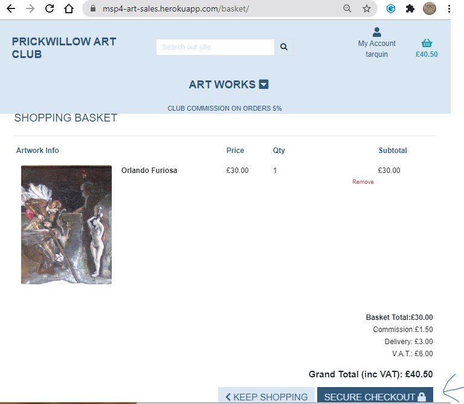
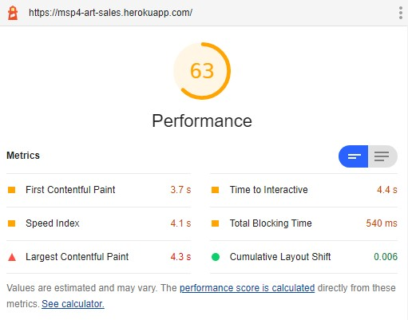

- [Testing](#testing)
  * [Feature testing](#feature-testing)
  * [Bug testing](#bug-testing)
  * [User Story testing](#user-story-testing)
  * [Responsiveness](#responsiveness)
  * [Python pylint](#python-pylint)
- [Lighthouse reports](#lighthouse-reports)
  * [Accessibility: 81](#accessibility--81)
  * [Best Practices: 93](#best-practices--93)
  * [Accessibility: 98](#accessibility--98)
  * [Performance: 63](#performance--63)

[TOC](http://ecotrust-canada.github.io/markdown-toc/)

## Testing

[Return to Readme](../../README.md#testing)

### Feature testing

#### 1  a remote API to receive a patron's payments by credit card, securely [STRIPE](https://stripe.com/gb).

Adding an artwork to  the basket.
- 
Confirming contents of basket and prompting for checkout.
- 
Checkout order completion.
- 
Checkout success.

**Anomaly found: email address?**
- 
Buyer checking their profile for order. 
**No email address**
- 
Buyer checking order details.
**Again informing buyer of email confirmation to wrong address**
- 

#### 2  using the same payment feature, allow club members to pay their annual subscription easily.

#### 3  a query and classification of artworks that allows easy browsing of selected images and their details.

Initial artwork page is 'All Artworks'.
- 
Drop down menu of sorting views.
- 
Display by ascending price.
- 
Display in artist order.
- 
Display by category.
**Category codes, not 'friendly names'**.
- 
Using query search to look for a word in either title or description.
- 
Searched word contained in artwork description.
- 
Using search for part of artwork title.
- 
**Cannot search for artist with query**
- 

#### 4  an email confirmation of sale and paid subscription.

#### 5  a secure login to allow a logged in member or patron to view their previous orders, paid subscriptions, and a club member's sold works.


#### 6  a shopping basket of selected works with a running total of price, VAT and commision due.


### Bug testing
---
#### 1. Artworks programming error
---


Model migration changes had not been implemented on Heroku server.

[Heroku Migrations](heroku_artworks_debug_error.txt)


#### 2. Server Error (500) upon login
---


This was caused by a wayward migration to update production models.
It cleared the profiles table 'Patron' that had a foreign key relation to alluath's user.

Temporarily set the Patron to be created upon login, regardless.

Then logged in as admin and entered Patron details for  the superuser 'mdjg' to be able to login.

Rolled back the code changes to enable this, and then logged in successfully.

#### 3. Server Error (500) upon adding artworks
---
Used Heroku CLI on Gitpod to access logs.

``` $heroku login -i```

Log showed 500 error

``` $heroku logs -tail --app msp4-art-sales ```

>> 2021-03-26T10:14:53.098938+00:00 heroku[router]: at=info method=POST path="/artworks/add/" host=msp4-art-sales.herokuapp.com request_id=85aef46d-ee34-495e-b48e-100db0362d1f fwd="86.16.134.162" dyno=web.1 connect=1ms service=1021ms status=**500** bytes=410 protocol=https
2021-03-26T10:14:53.101596+00:00 app[web.1]: 10.12.163.136 - - [26/Mar/2021:10:14:53 +0000] "POST /artworks/add/ HTTP/1.1"**500** 145 "https://msp4-art-sales.herokuapp.com/artworks/add/" "Mozilla/5.0 (Windows NT 10.0) AppleWebKit/537.36 (KHTML, like Gecko) Chrome/89.0.4389.90 Safari/537.36"
2021-03-26T10:14:53.482663+00:00 heroku[router]: at=info method=GET path="/favicon.ico" host=msp4-art-sales.herokuapp.com request_id=e2b1a32e-f9f9-47a9-a492-181d0e4960c4 fwd="86.16.134.162" dyno=web.1 connect=0ms service=44ms status=404 bytes=9845 protocol=https
<<

Checking that all database migrations have been enacted on production.

``` $heroku run python3 manage.py showmigrations --app msp4-art-sales```

No, one had not.


>artworks
>- [X] 0001_initial
>- [X] 0002_auto_20210313_1027
>- [X] 0003_auto_20210320_1623
>- [X] 0004_auto_20210321_1834
>- **[ ] 0005_auto_20210326_0846**

>auth

##### Resolution
``` $heroku run python3 manage.py migrate --app msp4-art-sales ```

>Running migrations:
  Applying artworks.0005_auto_20210326_0846... OK
  
``` $heroku logs -tail --app msp4-art-sales```

>2021-03-26T10:20:17.788918+00:00 app[web.1]: 10.11.223.86 - - [26/Mar/2021:10:20:17 +0000] "GET /artworks/29/ HTTP/1.1"**200** 13502 "https://msp4-art-sales.herokuapp.com/artworks/add/" "Mozilla/5.0 (Windows NT 10.0) AppleWebKit/537.36 (KHTML, like Gecko) Chrome/89.0.4389.90 Safari/537.36"

#### 4. No order details displayed on order confirmation.
---

##### User Story 2 bug


##### Resolution

Amended code on checkout model to display order item default
and appropriate display line on checkout_success page.


### User Story testing
---
#### 1 As a visitor to the site I would like to view art works for sale
    If I see something I like, I would like to know the price, what it's made of and size of it ( will it 'fit' on my wall or shelf ), as well as it's title and who made it.
---

Initial view of club's artworks.


Individual artwork displaying dimensions of the work.


#### 2 As a patron I would like to buy artworks within my price range and likes
---
Initial artwork sought.


Artwork successfully added to basket.


Artwork in basket with purchase details ready to be purchased.


Purchase details added. Will the purchaser be a one-off, or will they purchase more in the future?

Using STRIPE's test [credit card details](https://stripe.com/docs/payments/accept-a-payment#testing).

Purchaser completing order without logging in (a one-off sale).


Order has succesful feedback and confirmation email sent.


- **There is a bug, the order details have not been displayed.**

Now marked as 'Just Sold!' on artworks page.


#### 3 As a frequent patron I would like to keep a record of my purchases with the club
---

A 'frequent patron' of the club suggests first registering with the club.

**Registration**

For testing purposes first set up a [dummy maildrop](https://maildrop.cc/inbox/tellulah).


Confirmation email dropped into test mailbox.


Pasted confirmation URL from mailbox.


Password accepted.


Now logged in, 'frequent patron' has an empty wall and can go for a spree to cover it with pictures.

**Spree**

First order.


Second Order.


Order History section of Tellulah's profile.


Each order is linked to order confirmation email details.


**Additional Test: Checking normal logged in user cannot access administration**

Logged in as Tellulah tried to access /admin in URL:


#### 4 As a patron I would like to keep a running total of incomplete orders,
            including V.A.T.,
            delivery charges (if not collecting)
            and potential commission to the club.
---

Every time an artwork is added to the basket, there is a pop-up to inform.


Going to 'Secure Checkout' will display a detailed running total.


#### 5 As a club member I would like to purchase my year's club membership subscription remotely
---
#### 6 As a member of the art club, I may like to have a record of my work that sold via the club's site
---

Firstly register a member as a valid user login to the club.

- 

- 

- 

Now that Tarquin can log into the club's website, he can view his sold work.

- 

A page displaying the logged in member's sold works.

- 

#### 7 As a club administrator I would like to enter new works of art as images with details such as price, media and dimensions of the piece
---
From Heroku logs :
> 2021-03-26T10:20:17.788918+00:00 app[web.1]: 10.11.223.86 - - 
>[26/Mar/2021:10:20:17 +0000] "GET /artworks/29/ HTTP/1.1" 200 13502 "https://msp4-art-sales.herokuapp.com/artworks/add/" "Mozilla/5.0 (Windows NT 10.0) AppleWebKit/537.36 (KHTML, like Gecko) Chrome/89.0.4389.90 Safari/537.36"

Checked artwork (id 29) within admin:


```https://msp4-art-sales.herokuapp.com/artworks/29/```


#### 8 As a club administrator I would like an idea of sales commissions in order to distribute funds to activities that will benefit the club
---

Initially commissions can be viewed by a superuser via the admin screens, Orders:

- 

Not ideal. Sub totals for commission and price would be useful.
Reporting by a date grouping would be informative.

- 
Sub totals are still not being displayed.

Access to commission summary is via super user login only.
- 

Smaller screens have an abridged version of the table.
- 


### Responsiveness
---
Using Google's Mobile Friendly Test Facility.

[Mobile Friendly Test](https://search.google.com/test/mobile-friendly?id=cQq8QMNS74JlrS_CK1sQFg)

- 

A page loading issue raised by Mobile Friendly can be explained by STRIPE blocking robots....

- 

### Python pylint
---
There were a number of flagged errors of the type "Class 'Patron' has no 'objects' member".

According to [Stack Overflow](https://stackoverflow.com/questions/58255016/class-has-no-objects-member) this is a warning caused by usual pylint not recognising Django Metaclasses.
Ensured on gitpod environment that pylint-django was installed, ```pip3 freeze```

- pylint==2.7.2
- pylint-django==2.4.2
- pylint-plugin-utils==0.6

The other main problem is 'line too long', flake8(E501) errors.
Again [Stack Overflow](https://stackoverflow.com/questions/48881196/how-to-split-up-a-long-f-string-in-python#48881390) explains.

#### pep8 checks

> pep8 has been renamed to pycodestyle (GitHub issue #466)
> Use of the pep8 tool will be removed in a future release.
> Please install and use `pycodestyle` instead.

```/workspace/MSP4_art_sales $ ls -1```

gives directories ('apps') :
- artworks ```pycodestyle -v --exclude=migrations artworks > docs/pycodestyle/artworks.txt```
- basket ```pycodestyle -v --exclude=migrations checkout > docs/pycodestyle/checkout.txt```
- checkout ```pycodestyle -v --exclude=migrations checkout > docs/pycodestyle/checkout.txt```
- custom_storages.py ```pycodestyle -v custom_storages.py > docs/pycodestyle/custom_storages.txt```
- home ```pycodestyle -v --exclude=migrations home > docs/pycodestyle/home.txt```
- manage.py ```pycodestyle -v manage.py > docs/pycodestyle/manage.txt```
- members ```pycodestyle -v --exclude=migrations members > docs/pycodestyle/members.txt```
- msp4_art_sales ```pycodestyle -v --exclude=migrations msp4_art_sales > docs/pycodestyle/msp4_art_sales.txt```
- profiles ```pycodestyle -v --exclude=migrations profiles > docs/pycodestyle/profiles.txt```
- templates ```pycodestyle -v --exclude=migrations templates > docs/pycodestyle/templates.txt```

There has been discussion in Code Institute's SLACK chat site whether to include Django's generated python files when checking with python linter.
I agree that it serves no purpose to attempt to check and alter migration files, as the long lines reported could improve migration's efficiency.
Hence ``` --exclude=migrations``` above.

There were enough self-inflicted long lines reports, e.g. 
- [Checkout Report](../pycodestyle/checkout.txt)
- [Profiles Report](../pycodestyle/profiles.txt)


## Lighthouse reports

[Lighthouse Report 28th March 2021](lighthouse_report_1.html)

### Accessibility: 81

Report points to improve [the usage of ARIA](https://developers.google.com/web/fundamentals/accessibility/semantics-aria).
- Especially an error with non-unique Id, id="user-options".
-  Heading elements are not in a sequentially-descending order .
-  \<html> element does not have a [lang] attribute.
-  List items \<li> are not contained within \<ul> or \<ol> parent elements. 


### Best Practices: 93

Report shows JavasSript has vulnerabilities.
-  Includes front-end JavaScript libraries with [known security vulnerabilities](https://web.dev/no-vulnerable-libraries/?utm_source=lighthouse&utm_medium=devtools).

-

### Accessibility: 98
Acted upon Lighthouse Report recommendations.
- Especialy ARIA Unique ID, set mobile top header ID to 'user-options-mob'.
- Added lang="en" to \<html> header tag in base page.
- mobile top header also had \<li> elements without surrounding \<ul> parent element.

-

### SEO: 100
Search Engine Optimisation.

-

### Performance: 63
The CHROME Developer Lighthouse Report advised running incognito to achieve results, as Chrome has extensions that impaired performace.

-
